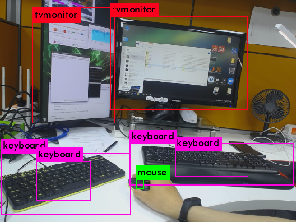

# YOLO and ROS version installation, implementation, application, and comparison
+ Darknet version: [recent github](https://github.com/AlexeyAB/darknet), [old homepage](https://pjreddie.com/darknet/), [old github](https://github.com/pjreddie/darknet)
+ OpenCV(DNN) version: [original code gist](https://gist.github.com/YashasSamaga/e2b19a6807a13046e399f4bc3cca3a49)
  + [OpenCV-dnn benchmark and discuss](https://github.com/AlexeyAB/darknet/issues/6245), [OpenCV-dnn benchmark](https://github.com/AlexeyAB/darknet/issues/6067)
+ OpenVINO version: this repo used `OpenVINO's prebuilt OpenCV + dnn` but there are other versions: [v4 and v4tiny](https://github.com/TNTWEN/OpenVINO-YOLOV4), [v3 and v3tiny](https://github.com/PINTO0309/OpenVINO-YoloV3)
+ TensorRT(tkDNN) version - [github](https://github.com/ceccocats/tkDNN)
+ other versions: [other versions links in original github](https://github.com/AlexeyAB/darknet#yolo-v4-in-other-frameworks)

 

| YOLO v3 / v3-tiny v4 / v4-tiny|                        Remark                    |     CPU version | CPU openMP AVX |     GPU support    |
|:-----------------------------------:|:------------------------------------------------:|:---------------:|:--------------------:|:------------------:|
|               Darknet               |                     .c codes                     |        O        |           O          | O, from CUDA 10.1  |
|              OpenCV-dnn             |               OpenCV ver from 4.4.0              |        O        |           -          |          -         |
|      OpenCV-dnn + CUDA/cuDNN     |                 OpenCV ver from 4.4.0            |     utilized    |           -          |          O         |
|               OpenVINO              |                     Intel only                   |        O        |           -          | Only for GPU stick |
|           TensorRT(tkDNN)           |                      need GPU                    |     utilized    |           -          |          O         |

 

# Index
## 1. [Results](#1-results-1)

## 2. Prerequisites
#### ● [`.weights` and `.cfg` files](#-weights-and-cfg-files-1)
#### ● [CMake version upgrade](#-cmake-version-upgrade): upper than 3.13 for OpenVINO, upper than 3.15 for TensorRT(tkDNN), upper than 3.12.8 to train custom data
#### ● [CUDA / cuDNN](#-cuda--cudnn-1)
#### ● [OpenCV with CUDA / cuDNN](#-opencv-with-cuda--cudnn-1)
#### ● OpenCV with OpenVINO manual build: not recommended, [direct link](https://github.com/opencv/opencv/wiki/Intel's-Deep-Learning-Inference-Engine-backend)
  + OpenVINO's prebuilt binary OpenCV is recommended instead. Refer installation below
#### ● [cv_bridge](#-cv_bridge-opencv---ros-bridge): OpenCV - ROS bridge, should be built when OpenCV is manually built
#### ● [TensorRT](#-tensorrt-1)
#### ● [OpenVINO](#-openvino-1)

## 3. Installation
#### ● [Darknet ver.](#-darknet-ver-2)
#### ● [OpenCV(DNN) ver. / OpenVINO ver.](#-opencvdnn-ver--openvino-ver-2)
#### ● [TensorRT(tkDNN) ver.](#-tensorrttkdnn-ver-2)

## 4. Installation for ROS version
#### ● [Darknet ver.](#-darknet-ver-3)
#### ● [OpenCV(DNN) ver. / OpenVINO ver.](#-opencvdnn-ver--openvino-ver-3)
#### ● [TensorRT(tkDNN) ver.](#-tensorrttkdnn-ver-3)

## 5. [How to train for custom data](#5-how-to-train-for-custom-data---refer-here-original-repo)
---

    

# 1. Results
#### ● Tested on [2015 MOT dataset](https://motchallenge.net/data/MOT15/), with 640x480 resolution
#### ● on i9-10900k+GTX Titan X(pascal) / i9-10900k+RTX 3080 / Intel NUC10i7FNH (i7-10710U) / Jetson TX2 / Jetson NX
#### ● GPU monitor: [nvtop](https://github.com/Syllo/nvtop) or [this python code](gpuGraph.py), edited from Jetsonhacks' [code for Jetson boards](https://github.com/jetsonhacks/gpuGraphTX)
[comment]: <> (## ● Youtube videos: <a href="https://www.youtube.com/playlist?list=PLvgPHeVm_WqIUHg7iu0g73-yaS08kv6-5" target="_blank">Playlist of all results</a>)
[comment]: <> (+ text
)

 

## ● Result clip on [Thermal camera](https://youtu.be/no8tMU9GWWA)
## ● Result clips: [Jetson Xavier NX](https://youtu.be/7DnZBvuw7H0), [Jetson TX2](https://youtu.be/fH9YxO4PKaM), [Intel NUC i710FNH](https://youtu.be/MuzW4W4kC2o), [RTX3080 + i9-10900k](https://youtu.be/6FZ06NAJXbA)
+ with MS-COCO pre-trained models (YOLO v4, YOLO v4-tiny)

 

| Jetson TX2 |     OpenCV(dnn) Only CPU    | OpenCV(dnn) +  CUDA/cuDNN FP32 |    TensorRT (tkDNN) FP32   |    TensorRT (tkDNN) FP16   |   TensorRT (tkDNN) INT8   |
|:----------:|:------------------------------:|:------------------------------------:|:--------------------------------:|:--------------------------------:|:-------------------------------:|
|     v4     |           impossible           |    3.79Hz @ CPU 74% GPU 57% [video](https://youtu.be/MHykXbcts10)   |  6.49Hz @ CPU 59% GPU 75% [video](https://youtu.be/zBdcRr9Y-wY) |  8.68Hz @ CPU 71% GPU 70% [video](https://youtu.be/WYxTtGCvxwA) |  6.42Hz @ CPU 57% GPU 68% [video](https://youtu.be/P0ga_LJBUlQ) |
|   v4-tiny  | 0.19Hz @ CPU 430% GPU 3% [video](https://youtu.be/72IczySK59c) |   13.65Hz @ CPU 154% GPU 27% [video](https://youtu.be/dMl2TL4KUxE) | 51.84Hz @ CPU 165% GPU 32% [video](https://youtu.be/thZXqmLahOc) | 71.62Hz @ CPU 177% GPU 27% [video](https://youtu.be/wpGuNjwJPiU) | 50.0Hz @ CPU 148% GPU 29% [video](https://youtu.be/M2cid-WkPI4) |

--- 

 

| Jetson Xavier NX |         darknet CPU         |  darknet GPU (cuDNN_HALF) |     OpenCV(dnn) Only CPU    | OpenCV(dnn) +  CUDA/cuDNN FP32 | OpenCV(dnn) +  CUDA/cuDNN FP16 |   TensorRT (tkDNN) FP32   |    TensorRT (tkDNN) FP16   |
|:----------------------:|:------------------------------:|:-------------------------------:|:------------------------------:|:------------------------------------:|:------------------------------------:|:-------------------------------:|:--------------------------------:|
|           v4           | 0.05Hz @ CPU 390% GPU 4% [video](https://youtu.be/1G8ffaEMcmk) |  3.8Hz @ CPU 118% GPU 98% [video](https://youtu.be/M9_ZX6j6Ics) | 0.37Hz @ CPU 376% GPU 4% [video](https://youtu.be/Mvpz86oXsK4) |    5.76Hz @ CPU 76% GPU 98%  [video](https://youtu.be/ReJmfNFusZ8)  |    11.85Hz @ CPU 72% GPU 82%  [video](https://youtu.be/E_uEfL7D9KY) |  8.14Hz @ CPU 19% GPU 98% [video](https://youtu.be/bZq5970HrEQ) |  18.98Hz @ CPU 39% GPU 80% [video](https://youtu.be/he93LDzAekw) |
|         v4-tiny        |  1.3Hz @ CPU 366% GPU 3% [video](https://youtu.be/TEGfNpYXLgQ) | 37.9Hz @ CPU 197% GPU 71% [video](https://youtu.be/qlBLyWljqO4) |  3.6Hz @ CPU 340% GPU 5% [video](https://youtu.be/EUKP4l3WsZM) |    39.7Hz @ CPU 84% GPU 68% [video](https://youtu.be/atXI778GuM4)   |    62.7Hz @ CPU 86% GPU 43% [video](https://youtu.be/MwRgBRG3D7k)   | 69.05Hz @ CPU 62% GPU 54% [video](https://youtu.be/a42ybz8ZGR8) | 172.36Hz @ CPU 84% GPU 32% [video](https://youtu.be/s2JzhiwXhm4) |

---

 

| Intel NUC i710FNH (i7-10710U) CPU only | darknet CPU (openMP, AVX) |      OpenCV(dnn)      | OpenVINO + OpenCV(dnn) |
|:--------------------------------------------:|:-------------------------------:|:---------------------:|:-------------------------:|
|                      v4                      |       0.2Hz @ CPU 1120% [video](https://youtu.be/etNyDCMOrFc)     | 3.78Hz @ CPU 1080% [video](https://youtu.be/mAJ-M4WMhLc) |   4.67Hz @ CPU 1035% [video](https://youtu.be/XACxGqeaqxc)  |
|                    v4-tiny                   |       3.5Hz @ CPU 1160% [video](https://youtu.be/sZ5kl8yJw-o)     |  31.5Hz @ CPU 980% [video](https://youtu.be/sRjOXKoANQ0) |   43.61Hz @ CPU 880% [video](https://youtu.be/nWVpYE0Osj4)  |

---

 

| i9-10900k + RTX3080 | Darknet CPU (OpenMP AVX) | Darknet GPU (cuDNN_HALF OpenMP AVX) |     OpenCV(dnn) Only CPU    | OpenCV(dnn) + CUDA/cuDNN FP32 | OpenCV(dnn) + CUDA/cuDNN FP16 |    OpenVINO + OpenCV(dnn)    |   TensorRT (tkDNN) FP32   |    TensorRT (tkDNN) FP16   |
|:----------------------:|:---------------------------------:|:-----------------------------------------------:|:------------------------------:|:-----------------------------------:|:-----------------------------------:|:-------------------------------:|:-------------------------------:|:--------------------------------:|
|           v4           |   0.3Hz CPU 1915% GPU 30% [video](https://youtu.be/gUPTXNNnDQk)  |          62.1Hz CPU 245% GPU 93% [video](https://youtu.be/ZPsxvp0muok)         |  7.55Hz CPU 1365% GPU 5% [video](https://youtu.be/OaGLWDMROLM) |    80.64Hz CPU 103% GPU 52% [video](https://youtu.be/v-N6SfM0WHk)  |   105.81Hz CPU 105% GPU 39% [video](https://youtu.be/BiVUIaJXugw)  |  10.02Hz CPU 1640% GPU 4% [video](https://youtu.be/GHqXfGbefsg) | 131.73Hz CPU 111% GPU 56% [video](https://youtu.be/a_-R2gibuW4) |  255.98Hz CPU 116% GPU 47% [video](https://youtu.be/9kLTA8WK8ds) |
|         v4-tiny        |   3.6Hz CPU 1940% GPU 30% [video](https://youtu.be/pFY6cNjnHYw)  |          336.7Hz CPU 320% GPU 55% [video](https://youtu.be/5zEsxF90Tzc)        | 52.22Hz CPU 950% GPU 11% [video](https://youtu.be/GxCgDa7sUi4) |     297Hz CPU 115% GPU 32% [video](https://youtu.be/cqQm280H5WA)   |    273.6Hz CPU 114% GPU 29% [video](https://youtu.be/7btTh3AKIHg)  | 71.08Hz CPU 1260% GPU 12% [video](https://youtu.be/iM-ID5BDdD0) | 729.57Hz CPU 127% GPU 27% [video](https://youtu.be/CcLWqGmIRA4) | 1296.91Hz CPU 129% GPU 22% [video](https://youtu.be/N4F1K3h8Smg) |

---

 

| i9-10900k +  GTX Titan X(Pascal) |    Darknet CPU   |          Darknet GPU          |      OpenCV(dnn) Only CPU     |    OpenCV(dnn) + CUDA/cuDNN   |     OpenVINO + OpenCV(dnn)    |    TensorRT (tkDNN) FP32   |    TensorRT (tkDNN) FP16   |
|:-----------------------------------:|:-------------------:|:--------------------------------:|:--------------------------------:|:--------------------------------:|:--------------------------------:|:--------------------------------:|:--------------------------------:|
|                  v4                 | 0.1Hz @ CPU 199% |  26.7Hz @ CPU 222% GPU 97% [video](https://youtu.be/-Gn7iob4dI8) |  7.5Hz @ CPU 1590% GPU 12% [video](https://youtu.be/DUjkmB-PTB0) |  57.1Hz @ CPU 101% GPU 68% [video](https://youtu.be/78A3HelDEu4) |  10.9Hz @ CPU 1600% GPU 9% [video](https://youtu.be/XkP_bYbVWYQ) |  76.1Hz @ CPU 104% GPU 67% [video](https://youtu.be/mK9PXYgXLx4) |  75.9Hz @ CPU 104% GPU 68% [video](https://youtu.be/LQ8kVqx0FUs) |
|               v4-tiny               | 1.9Hz @ CPU 198% | 293.5Hz @ CPU 378% GPU 92% [video](https://youtu.be/A0mh4d0KxsA) | 57.5Hz @ CPU 1300% GPU 26% [video](https://youtu.be/R8SoMESnHjw) | 225.7Hz @ CPU 107% GPU 51% [video](https://youtu.be/qkb4K3MLV7U) | 64.7Hz @ CPU 1080% GPU 26% [video](https://youtu.be/u5U72m7DBBQ) | 427.8Hz @ CPU 115% GPU 39% [video](https://youtu.be/xVm7gvxYkzE) | 434.2Hz @ CPU 116% GPU 39% [video](https://youtu.be/iuq9ht87TEU) |

--- 

 

  
   

# 2. Prerequisites

### ● `.weights` and `.cfg` files
+ Download `.weights` from homepage
~~~shell
  $ cd ~/darknet
  $ wget https://pjreddie.com/media/files/yolov3.weights
  $ wget https://pjreddie.com/media/files/yolov3-tiny.weights #for tiny (much faster, less accurate)
  $ wget https://github.com/AlexeyAB/darknet/releases/download/darknet_yolo_v3_optimal/yolov4.weights
  $ wget https://github.com/AlexeyAB/darknet/releases/download/darknet_yolo_v4_pre/yolov4-tiny.weights
~~~
+ Download `.cfg` from [homepage](https://github.com/AlexeyAB/darknet/tree/master/cfg)
+ Further versions can be checked [here](https://github.com/AlexeyAB/darknet#pre-trained-models)

### ● CMake version upgrade

[CLICK HERE To See]

~~~shell
$ wget https://github.com/Kitware/CMake/releases/download/v3.19.8/cmake-3.19.8.tar.gz
$ tar zxf cmake-3.19.8.tar.gz && cd cmake-3.19.8
$ ./bootstrap
$ make
$ sudo make install

# check, reboot can be needed.
$ cmake --version 
~~~

---

 

### ● CUDA / cuDNN

[CLICK HERE To See]

### ● Install **CUDA** and **Graphic Driver**: 
##### ● (If you will use TensorRT) The latest TensorRT(7.2.3) supports CUDA 10.2, 11.0 update 1, 11.1 update 1, ~~and 11.2 update 1.~~ [doc](https://docs.nvidia.com/deeplearning/tensorrt/archives/tensorrt-723/release-notes/tensorrt-7.html#rel_7-2-3)
+ Ubuntu
~~~shell
    $ sudo apt install gcc make
    get the right version of CUDA(with graphic driver) .deb file at https://developer.nvidia.com/cuda-downloads
    follow the installation instructions there!
        # .run file can be used as nvidia graphic driver. But, .deb file is recommended to install tensorRT further.
        # if want to install only graphic driver, get graphic driver install script at https://www.nvidia.com/Download/index.aspx?lang=en-us
        # sudo ./NVIDIA_<graphic_driver_installer>.run --dkms
        # --dkms option is recommended when you also install NVIDIA driver, to register it along with kernel
        # otherwise, NVIDIA graphic driver will be gone after kernel upgrade via $ sudo apt upgrade
    $ sudo reboot
    
    $ gedit ~/.bashrc
    # type and save
    export PATH=<CUDA_PATH>/bin:$PATH #ex: /usr/local/cuda-11.1
    export LD_LIBRARY_PATH=<CUDA_PATH>/lib64:$LD_LIBRARY_PATH #ex : /usr/local/cuda-11.1
    $ . ~/.bashrc
    
    # check if installed well
    $ dpkg-query -W | grep cuda
~~~
+ check CUDA version using **nvcc --version**
~~~shell
# check installed cuda version
$ nvcc --version
# if nvcc --version does not print out CUDA,
$ gedit ~/.profile
# type below and save
export PATH=<CUDA_PATH>/bin:$PATH #ex: /usr/local/cuda-11.1
export LD_LIBRARY_PATH=<CUDA_PATH>/lib64:$LD_LIBRARY_PATH #ex : /usr/local/cuda-11.1
$ source ~/.profile
~~~

### ● Trouble shooting for NVIDIA driver or CUDA: please see /var/log/cuda-installer.log or /var/log/nvidia-install.log
+ Installation failed. See log at /var/log/cuda-installer.log for details => mostly because of `X server` is being used.
    + turn off `X server` and install.
~~~shell
# if you are using lightdm
$ sudo service lightdm stop

# or if you are using gdm3
$ sudo service gdm3

# then press Ctrl+Alt+F3 -> login with your ID/password
$ sudo sh cuda_<version>_linux.run
~~~
+ The kernel module failed to load. Secure boot is enabled on this system, so this is likely because it was not signed by a key that is trusted by the kernel.... 
    + turn off `Secure Boot` as below [reference](https://wiki.ubuntu.com/UEFI/SecureBoot/DKMS)
    + If you got this case, you should turn off `Secure Boot` and then turn off `X server` (as above) both.

 

### ● cuDNN: strong library for Neural Network used with CUDA
+ Download [here](https://developer.nvidia.com/cudnn)
+ install as below: [reference in Korean](https://cafepurple.tistory.com/39)
~~~shell
$ sudo tar zxf cudnn.tgz
$ sudo cp extracted_cuda/include/* <CUDA_PATH>/include/   #ex /usr/local/cuda-11.1/include/
$ sudo cp -P extracted_cuda/lib64/* <CUDA_PATH>/lib64/   #ex /usr/local/cuda-11.1/lib64/
$ sudo chmod a+r <CUDA_PATH>/lib64/libcudnn*   #ex /usr/local/cuda-11.1/lib64/libcudnn*
~~~

---

 

### ● OpenCV with CUDA / cuDNN

[CLICK HERE To See]

### ● Build OpenCV with CUDA / cuDNN - references: [link 1](https://webnautes.tistory.com/1030), [link 2](https://github.com/jetsonhacks/buildOpenCVXavier/blob/master/buildOpenCV.sh)
+ **-D OPENCV_GENERATE_PKGCONFIG=YES** option is also needed for OpenCV 4.X
  + and copy the generated `opencv4.pc` file to `/usr/local/lib/pkgconfig` or `/usr/lib/aarch64-linux-gnu/pkgconfig` for jetson boards
~~~shell
$ sudo apt-get purge libopencv* python-opencv
$ sudo apt-get update
$ sudo apt-get install -y build-essential pkg-config
$ sudo apt-get install -y cmake libavcodec-dev libavformat-dev libavutil-dev \
    libglew-dev libgtk2.0-dev libgtk-3-dev libjpeg-dev libpng-dev libpostproc-dev \
    libswscale-dev libtbb-dev libtiff5-dev libv4l-dev libxvidcore-dev \
    libx264-dev qt5-default zlib1g-dev libgl1 libglvnd-dev pkg-config \
    libgstreamer1.0-dev libgstreamer-plugins-base1.0-dev mesa-utils #libeigen3-dev # recommend to build from source : http://eigen.tuxfamily.org/index.php?title=Main_Page
$ sudo apt-get install python2.7-dev python3-dev python-numpy python3-numpy
$ mkdir <opencv_source_directory> && cd <opencv_source_directory>
$ wget -O opencv.zip https://github.com/opencv/opencv/archive/4.5.2.zip # check version
$ unzip opencv.zip
$ cd <opencv_source_directory>/opencv && mkdir build && cd build
# check your BIN version : http://arnon.dk/matching-sm-architectures-arch-and-gencode-for-various-nvidia-cards/
# 8.6 for RTX3080 7.2 for Xavier, 5.2 for GTX TITAN X, 6.1 for GTX TITAN X(pascal)
# -D BUILD_opencv_cudacodec=OFF #for cuda10-opencv3.4
$ cmake -D CMAKE_BUILD_TYPE=RELEASE \
      -D CMAKE_C_COMPILER=gcc-6 \
      -D CMAKE_CXX_COMPILER=g++-6 \
      -D CMAKE_INSTALL_PREFIX=/usr/local \
      -D OPENCV_GENERATE_PKGCONFIG=YES \
      -D WITH_CUDA=ON \
      -D OPENCV_DNN_CUDA=ON \
      -D WITH_CUDNN=ON \
      -D CUDA_ARCH_BIN=7.2 \
      -D CUDA_ARCH_PTX="" \
      -D ENABLE_FAST_MATH=ON \
      -D CUDA_FAST_MATH=ON \
      -D WITH_CUBLAS=ON \
      -D WITH_LIBV4L=ON \
      -D WITH_GSTREAMER=ON \
      -D WITH_GSTREAMER_0_10=OFF \
      -D WITH_QT=ON \
      -D WITH_OPENGL=ON \
      -D BUILD_opencv_cudacodec=OFF \
      -D CUDA_NVCC_FLAGS="--expt-relaxed-constexpr" \
      -D WITH_TBB=ON \
      ../
$ time make -j8 # 8 : numbers of core

# when make error, use only one core as
$ time make -j1 # important, use only one core to prevent compile error

$ sudo make install
$ sudo rm -r <opencv_source_directory> #optional
~~~

 

### ● Trouble shooting for OpenCV build error:
+ Please include the appropriate gl headers before including cuda_gl_interop.h => reference [1](https://github.com/jetsonhacks/buildOpenCVXavier/blob/master/buildOpenCV.sh#L101), [2](https://github.com/jetsonhacks/buildOpenCVXavier/blob/master/patches/OpenGLHeader.patch), [3](https://devtalk.nvidia.com/default/topic/1007290/jetson-tx2/building-opencv-with-opengl-support-/post/5141945/#5141945)
+ modules/cudacodec/src/precomp.hpp:60:37: fatal error: dynlink_nvcuvid.h: No such file or directory
compilation terminated. --> **for CUDA version 10**
    + => reference [here](https://devtalk.nvidia.com/default/topic/1044773/cuda-setup-and-installation/error-in-installing-opencv-3-4-0-on-cuda-10/)
    + cmake ... -D BUILD_opencv_cudacodec=OFF ...
+ CUDA_nppicom_LIBRARY not found => reference [here](https://stackoverflow.com/questions/46584000/cmake-error-variables-are-set-to-notfound)
    + $ sudo apt-get install nvidia-cuda-toolkit
    + or Edit *FindCUDA.cmake* and *OpenCVDetectCUDA.cmake*

### ● (Optional) if also **contrib** for OpenCV should be built,
+ add **-D OPENCV_EXTRA_MODULES_PATH** option as below:

~~~shell
$ cd <opencv_source_directory>
$ wget -O opencv_contrib.zip https://github.com/opencv/opencv_contrib/archive/4.5.2.zip #check version
$ unzip opencv_contrib.zip
$ cd <opencv_source_directory>/build
$ cmake -D CMAKE_BUILD_TYPE=RELEASE \
      -D CMAKE_C_COMPILER=gcc-6 \
      -D CMAKE_CXX_COMPILER=g++-6 \
      -D CMAKE_INSTALL_PREFIX=/usr/local \
      -D OPENCV_GENERATE_PKGCONFIG=YES \
      -D WITH_CUDA=ON \
      -D OPENCV_DNN_CUDA=ON \
      -D WITH_CUDNN=ON \
      -D CUDA_ARCH_BIN=7.2 \
      -D CUDA_ARCH_PTX="" \
      -D ENABLE_FAST_MATH=ON \
      -D CUDA_FAST_MATH=ON \
      -D WITH_CUBLAS=ON \
      -D WITH_LIBV4L=ON \
      -D WITH_GSTREAMER=ON \
      -D WITH_GSTREAMER_0_10=OFF \
      -D WITH_QT=ON \
      -D WITH_OPENGL=ON \
      -D BUILD_opencv_cudacodec=OFF \
      -D CUDA_NVCC_FLAGS="--expt-relaxed-constexpr" \
      -D WITH_TBB=ON \
      -D OPENCV_EXTRA_MODULES_PATH=../opencv_contrib-4.5.2/modules \
      ../
$ time make -j1 # important, use only one core to prevent compile error
$ sudo make install
~~~

---

 

### ● cv_bridge: OpenCV - ROS bridge

[CLICK HERE for OpenCV version 4.X]

### ● CV_bridge with OpenCV 4.X version
+ Referred [here](https://github.com/ros-perception/vision_opencv/issues/272#issuecomment-471311300)
~~~shell
$ cd ~/catkin_ws/src && git clone https://github.com/ros-perception/vision_opencv
# since ROS Noetic is added, we have to checkout to melodic tree
$ cd vision_opencv && git checkout origin/melodic
$ gedit vision_opencv/cv_bridge/CMakeLists.txt
~~~
+ Add options and edit OpenCV PATHS in `CMakeLists.txt`
~~~txt
# add right after project()
set(CMAKE_CXX_STANDARD 11) 

# edit find_package(OpenCV)
#find_package(OpenCV 4 REQUIRED PATHS /usr/local/share/opencv4 NO_DEFAULT_PATH
find_package(OpenCV 4 REQUIRED
  COMPONENTS
    opencv_core
    opencv_imgproc
    opencv_imgcodecs
  CONFIG
)
include(/usr/local/lib/cmake/opencv4/OpenCVConfig.cmake)
~~~
+ Edit `cv_bridge/src/CMakeLists.txt`
~~~txt
# line number 35, Edit 3 -> 4
if (OpenCV_VERSION_MAJOR VERSION_EQUAL 4)
~~~
+ Edit `cv_bridge/src/module_opencv3.cpp`
~~~cpp
// line number 110
//    UMatData* allocate(int dims0, const int* sizes, int type, void* data, size_t* step, int flags, UMatUsageFlags usageFlags) const
    UMatData* allocate(int dims0, const int* sizes, int type, void* data, size_t* step, AccessFlag flags, UMatUsageFlags usageFlags) const

// line number 140
//    bool allocate(UMatData* u, int accessFlags, UMatUsageFlags usageFlags) const
    bool allocate(UMatData* u, AccessFlag accessFlags, UMatUsageFlags usageFlags) const
~~~
~~~shell
$ cd .. && catkin build cv_bridge
~~~

---

 

[CLICK HERE for OpenCV version 3.X]

  
### ● CV_bridge with OpenCV 3.X version
~~~shell
$ cd ~/catkin_ws/src && git clone https://github.com/ros-perception/vision_opencv

# since ROS Noetic is added, we have to checkout to melodic tree
$ cd vision_opencv && git checkout origin/melodic
$ gedit vision_opencv/cv_bridge/CMakeLists.txt
~~~
+ Edit OpenCV PATHS in CMakeLists and include cmake file
~~~txt
#when error, try both lines
find_package(OpenCV 3 REQUIRED PATHS /usr/local/share/OpenCV NO_DEFAULT_PATH
  COMPONENTS
    opencv_core
    opencv_imgproc
    opencv_imgcodecs
  CONFIG
)
include(/usr/local/share/OpenCV/OpenCVConfig.cmake) #under catkin_python_setup()
~~~

~~~shell
$ cd .. && catkin build cv_bridge
~~~

---

 

### ● TensorRT

[CLICK HERE To See]

#### ● The latest TensorRT(7.2.3) supports CUDA 10.2, 11.0 update 1, 11.1 update 1, and ~~11.2 update 1.~~ [doc](https://docs.nvidia.com/deeplearning/tensorrt/archives/tensorrt-723/release-notes/tensorrt-7.html#rel_7-2-3)   and also needs latest `cudNN 8.1.1`
+ Download right version of `TensorRT` at [nvidia download link](https://developer.nvidia.com/nvidia-tensorrt-download)
+ Install it
~~~shell
$ cd ~/Downloads
$ sudo dpkg -i nv-tensorrt-repo-ubuntu1804-cuda11.1-trt7.2.3.4-ga-20210226_1-1_amd64.deb

# copy-paste the result of .deb installation
$ sudo apt-key add /var/nv-tensorrt-repo-ubuntu1804-cuda11.1-trt7.2.3.4-ga-20210226/7fa2af80.pub

$ sudo apt update
$ sudo apt-get install tensorrt

$ sudo apt-get install python-libnvinfer-dev
$ sudo apt-get install python3-libnvinfer-dev

$ (optional for ONNX) sudo apt-get install onnx-graphsurgeon

Verify the installation!
$ dpkg -l | grep TensorRT
~~~

---

 

### ● OpenVINO

[CLICK HERE To See]

 

+ OpenVINO [Download link](https://software.intel.com/content/www/us/en/develop/tools/openvino-toolkit/download.html)
~~~shell
$ tar zxf l_openvino_toolkit_p_2021.3.394.tgz
$ cd l_openvino_toolkit_p_2021.3.394
$ sudo ./install_GUI.sh

$ cd /opt/intel/openvino_2021/install_dependencies
$ sudo -E ./install_openvino_dependencies.sh
$ echo "source /opt/intel/openvino_2021/bin/setupvars.sh" >> ~/.bashrc
# remember to delete this line in ~/.bashrc, if you want to use original OpenCV

$ cd /opt/intel/openvino_2021/deployment_tools/model_optimizer/install_prerequisites
$ sudo ./install_prerequisites.sh
~~~

---

   

# 3. Installation
### ● Darknet ver.

[CLICK HERE To See]

### ● Install darknet
+ Clone and make
~~~shell
  $ git clone https://github.com/AlexeyAB/darknet
  $ cd darknet
  $ gedit Makefile # => Edit if you want to use option 
     # OPENCV=1 is needed to watch GUI result
  # uncomment proper line "ARCH= -gencode arch=compute....." for your GPU
  $ make
~~~

### ● Execution
+ Using on Test data (Image)
~~~shell
  $ ./darknet detect cfg/yolov3.cfg yolov3.weights data/dog.jpg #or any other image files
  $ ./darknet detect cfg/yolov3-tiny.cfg yolov3-tiny.weights data/dog.jpg  #V3 tiny
~~~
+ Using on Test data (Video, Live)
~~~shell
# Video
  $ ./darknet detector demo cfg/coco.data cfg/yolov3.cfg yolov3.weights any_video.mp4

# Live camera
  $ ./darknet detector demo cfg/coco.data cfg/yolov3-tiny.cfg yolov3-tiny.weights -c 1 # 1 is camera number, as onboard camera is 0, usb camera is 1
  $ ./darknet detector demo cfg/coco.data cfg/yolov3-tiny.cfg yolov3-tiny.weights /dev/video1 #same here
~~~
+ Using onboard camera of TX2 development kit (Live), *tiny*
~~~shell
  $ ./darknet detector demo cfg/coco.data cfg/yolov3-tiny.cfg yolov3-tiny.weights "nvcamerasrc ! video/x-raw(memory:NVMM), width=(int)1280, height=(int)720,format=(string)I420, framerate=(fraction)30/1 ! nvvidconv flip-method=0 ! video/x-raw, format=(string)BGRx ! videoconvert ! video/x-raw, format=(string)BGR ! appsink"
~~~

### ● Trouble shooting
+ *No such file lib....* when **execute**
~~~shell
  $ sudo ldconfig
~~~

---

 

### ● OpenCV(DNN) ver. / OpenVINO ver.

[CLICK HERE To See]

### ● Available from OpenCV version 4.4.0
#### ● original [python and c++ code](https://raw.githubusercontent.com/engcang/ros-yolo-sort/master/YOLO_and_ROS_ver/OpenCV_dnn.py)   ● edited [python code](https://github.com/engcang/ros-yolo-sort/blob/master/YOLO_and_ROS_ver/OpenCV_dnn.py)

+ Get the code (edited one)
~~~shell
$ wget https://raw.githubusercontent.com/engcang/ros-yolo-sort/master/YOLO_and_ROS_ver/OpenCV_dnn.py

# Before run, check weight, cfg, class files' directory
$ python3 OpenCV_dnn.py
or for Python2,
$ python OpenCV_dnn.py
~~~

+ Read the comment in the code, choose a proper pair of `DNN_BACKEND` and `DNN_TARGET`. refer [here](https://docs.opencv.org/4.5.2/d6/d0f/group__dnn.html)

|  Remark |                 OpenCV with CUDA enabled                |    OpenCV with only CPU    |               OpenVINO               |
|:-------:|:-------------------------------------------------------:|:--------------------------:|:------------------------------------:|
| BACKEND |                 cv2.dnn.DNN_BACKEND_CUDA                | cv2.dnn.DNN_BACKEND_OPENCV | cv2.dnn.DNN_BACKEND_INFERENCE_ENGINE |
|  TARGET | cv2.dnn.DNN_TARGET_CUDA cv2.dnn.DNN_TARGET_CUDA_FP16 |   cv2.dnn.DNN_TARGET_CPU   |        cv2.dnn.DNN_TARGET_CPU        |

---

 

### ● TensorRT(tkDNN) ver.

[CLICK HERE To See]

 

### ● A lot referred from [here](https://github.com/Keunyoung-Jung/Yolov4-tkdnn)

### ● install tkDNN

~~~shell
$ git clone https://github.com/ceccocats/tkDNN
$ cd tkDNN
$ mkdir build && cd build
$ cmake ..
$ make
~~~
#### Fucking ★Trouble★ shooting
+ **error: ‘CUDNN_CONVOLUTION_BWD_DATA_PREFER_FASTEST’ was not declared in this scope**
  + cuDNN version is too recent. Apply [this patch](https://github.com/ceccocats/tkDNN/issues/74#issuecomment-659093110)
  + `$ cd tkdnn && patch -p1 < ./tkDNN_cudnn8support.patch`
+ **Please set them or make sure they are set and tested correctly in the CMake files: CUDA_cublas_device_LIBRARY (ADVANCED)**
  + (Almost cases) `Cmake version` is not met. Go to [here](#-cmake-version-upgrade-upper-than-313-for-openvino-upper-than-315-for-tensorrttkdnn-upper-than-3128-for-train-custom-data). Please check `Prerequisites` first!!!!!
  + (Less cases) CUDA libraries are not installed (libcublas, etc...)
  

### ● prepare `.rt file` ★much work to do★
+ Export `weight` and `cfg` file into `.bin` files as [original repo](https://github.com/ceccocats/tkDNN#how-to-export-weights)
~~~shell
Get the darknet (only for export, not used for detection)
$ git clone https://git.hipert.unimore.it/fgatti/darknet.git
If this darknet repo does not work, try with this one: 
              https://github.com/AlexeyAB/darknet/issues/6116#issuecomment-655483646
              https://github.com/AlexeyAB/darknet/files/4890564/darknet-master.zip
$ cd darknet
$ make
$ mkdir layers debug
$ ./darknet export <path-to-cfg-file> <path-to-weights> layers
-> .bin files are generated in debug and layers folders
~~~

+ Build `.rt` file, which can generate `executable file`
~~~shell
$ cd tkDNN/tests/darknet
$ cp yolo4.cpp <name_you_want>.cpp
$ gedit <name_you_want>.cpp
~~~
~~~cpp
std::string bin_path = "path from tkDNN/build folder"; //edit

// Edit here with output layer, check exported 'layers' folder
// e.g., for yolo v4 tiny, exported .bin file with name 'g' are 'g30.bin' and 'g37.bin'
// files starting with 'g' are output layer
std::vector<std::string> output_bins = {
    bin_path + "/debug/layer30_out.bin",
    bin_path + "/debug/layer37_out.bin"
};

// also check .cfg and .names (.txt) files directory
std::string cfg_path  = std::string(TKDNN_PATH) + "/tests/darknet/cfg/yolo4tiny.cfg";
std::string name_path = std::string(TKDNN_PATH) + "/tests/darknet/names/coco.names";
~~~
~~~shell
$ cd tkdnn/build
$ cmake .. && make

# executable file name with <name_you_want> is generated.
# Excute it to generate .rt file
### it reads the .cfg and .bin files written in <name_you_want>.cpp file, so directories should be accurate
$ ./test_<name_you_want> 
~~~

### ● Execution, refer [here](https://github.com/ceccocats/tkDNN/blob/master/docs/demo.md) for more detail
~~~shell
$ cd tkdnn/build

Edit the paths in the demoConfig.yaml file before!
$ ./demo ../demo/demoConfig.yaml
~~~

### ● Changing inference data type: **re-generate `.rt file` after export tkdnn mode**
~~~shell
type one of belows: (TKDNN_MODE=FP32 is default before change)
$ export TKDNN_MODE=FP16
$ export TKDNN_MODE=INT8

and re-generate .rt file as above before execute.
~~~

---

   

# 4. Installation for ROS version
### ● Darknet ver.

[CLICK HERE To See]

  
#### ● original repo - upto [v4 : here](https://github.com/tom13133/darknet_ros), upto [v3 : here](https://github.com/leggedrobotics/darknet_ros)
+ Get and build Darknet_ROS version from upto [v4 : here](https://github.com/tom13133/darknet_ros) upto v3 [here](https://github.com/leggedrobotics/darknet_ros)
~~~shell
$ cd catkin_workspace/src
$ git clone https://github.com/leggedrobotics/darknet_ros # up to v3
$ git clone https://github.com/tom13133/darknet_ros # up to v4
$ cd darknet_ros/ && git submodule update --init --recursive
$ cd ~/catkin_workspace
# before build, check (-O3 -gencode arch=compute_<version>,code=sm_<version>) part in darknet_ros/darknet_ros/CMakeLists.txt if you use CUDA
# ex) 75 for GTX1650, 86 for RTX3080
$ catkin build darknet_ros -DCMAKE_BUILD_TYPE=Release
~~~

### ● Execution and result
+ Use the proper `.yaml` files and `.launch` files as attached in this repo
~~~shell
$ roslaunch darknet_ros darknet_ros_yolov3tiny.launch network_param_file:=darknet_ros_yolov3tiny.yaml
or
$ roslaunch darknet_ros darknet_ros_yolov4tiny.launch network_param_file:=darknet_ros_yolov4tiny.yaml
~~~
+ with Logitech c930e Video clip

---

 

### ● OpenCV(DNN) ver. / OpenVINO ver.

[CLICK HERE To See]

### ● Available from OpenCV version 4.4.0
#### ● edited [python ros code](https://github.com/engcang/ros-yolo-sort/blob/master/YOLO_and_ROS_ver/ros_opencv_dnn.py)

+ Get the code (edited one)
~~~shell
$ wget https://raw.githubusercontent.com/engcang/ros-yolo-sort/master/YOLO_and_ROS_ver/ros_opencv_dnn.py

# Before run, check weight, cfg, class files' directory
# also check topic name, inference rates, etc.
$ python3 ros_opencv_dnn.py
or for Python2,
$ python ros_opencv_dnn.py

or to easily change parameters using .launch file,
$ chmod +x ros_opencv_dnn.py
$ mv ros_opencv_dnn.py ~/directory_of_ros_package_you_want/scripts/
$ gedit ~/directory_of_ros_package_you_want/launch/launch_file_you_want.launch
edit launch file with <param name="" value=""/>
~~~

+ Read the comment in the code, choose a proper pair of `DNN_BACKEND` and `DNN_TARGET`. refer [here](https://docs.opencv.org/4.5.2/d6/d0f/group__dnn.html)

|  Remark |                 OpenCV with CUDA enabled                |    OpenCV with only CPU    |               OpenVINO               |
|:-------:|:-------------------------------------------------------:|:--------------------------:|:------------------------------------:|
| BACKEND |                 cv2.dnn.DNN_BACKEND_CUDA                | cv2.dnn.DNN_BACKEND_OPENCV | cv2.dnn.DNN_BACKEND_INFERENCE_ENGINE |
|  TARGET | cv2.dnn.DNN_TARGET_CUDA cv2.dnn.DNN_TARGET_CUDA_FP16 |   cv2.dnn.DNN_TARGET_CPU   |        cv2.dnn.DNN_TARGET_CPU        |

---

 

### ● TensorRT(tkDNN) ver.

[CLICK HERE To See]

## How to install

+ Clone my other repo - [link](https://github.com/engcang/tkdnn-ros).
+ And build `tkDNN` first.

~~~shell
$ cd ~/<your_workspace>/src
$ git clone --recursive https://github.com/engcang/tkdnn-ros
$ cd tkdnn-ros/tkDNN
$ mkdir build 
$ mkdir installed
$ cd build
$ cmake .. -DCMAKE_BUILD_TYPE=RELEASE -DCMAKE_INSTALL_PREFIX=../installed
$ make install
~~~

+ build `ROS` package

~~~shell
$ cd ~/<your_workspace>

$ catkin build -DtkDNN_DIR=<absolute_path_to_your_workspace>/src/tkdnn-ros/tkDNN/installed/share/tkDNN/cmake

or

$ echo "export tkdnn_DIR=<absolute_path_to_your_workspace>/src/tkdnn-ros/tkDNN/installed/share/tkDNN/cmake" >> ~/.bashrc
$ . ~/.bashrc
$ catkin build

or

$ catkin config -DtkDNN_DIR=<absolute_path_to_your_workspace>/src/tkdnn-ros/tkDNN/installed/share/tkDNN/cmake
$ catkin build
~~~

+ Do not forget to register `tkDNN` libraries into `LD_LIBRARY_PATH`

~~~shell
$ cd ~/<your_workspace>
$ echo "export LD_LIBRARY_PATH=$LD_LIBRARY_PATH:$(pwd)/src/tkdnn-ros/tkDNN/installed/lib" >> ~/.bashrc
$ . ~/.bashrc
~~~

 

## How to run

+ Make sure you have `.rt` files, refer [here, within repo](https://github.com/engcang/ros-yolo-sort/tree/master/YOLO_and_ROS_ver#-tensorrttkdnn-ver-2)

+ change parameters in `main.launch` file

+ run the code
~~~shell
$ roslaunch tkdnn-ros main.launch
~~~
  
  
---

 

   

# 5. How to train for custom data - refer [here, original repo](https://github.com/AlexeyAB/darknet#how-to-train-to-detect-your-custom-objects)

[CLICK HERE To See]

#### ● Get the image data and label them
+ install [`yolo_mark`](https://github.com/AlexeyAB/Yolo_mark) and label images
  + need `cmake` upperthan 3.12.8, and `OpenCV`
  + check out the repo to see shortcuts and details
~~~shell
$ git clone https://github.com/AlexeyAB/Yolo_mark.git
$ cd Yolo_mark 
$ cmake . && make

$ cd Yolo_mark/x64/Release/data
$ gedit obj.data 
# edit the number of classes - e.g., classses=10

$ gedit obj.names
# edit the names of classes - e.g., person, drone, ...

$ cd img
# place all images you want to use to train

$ cd Yolo_mark && ./linux_mark.sh
# draw bounding boxes, then you get label files (.txt files)
~~~

#### ● Train images with labels
+ [details](https://github.com/AlexeyAB/darknet#how-to-train-to-detect-your-custom-objects)
~~~shell
# v4
$ ./darknet detector train data/obj.data yolov4-obj.cfg yolov4.conv.137

# v4-tiny & v4-tiny-3l
$ ./darknet detector train data/obj.data yolov4-tiny-obj.cfg yolov4-tiny.conv.29
~~~
+ Trouble shooting
  + **cannot load image error in load_data_detection() - OpenCV**: check if the path to images are correct in `train.txt`

---

 

