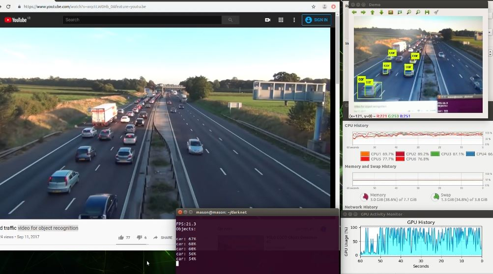
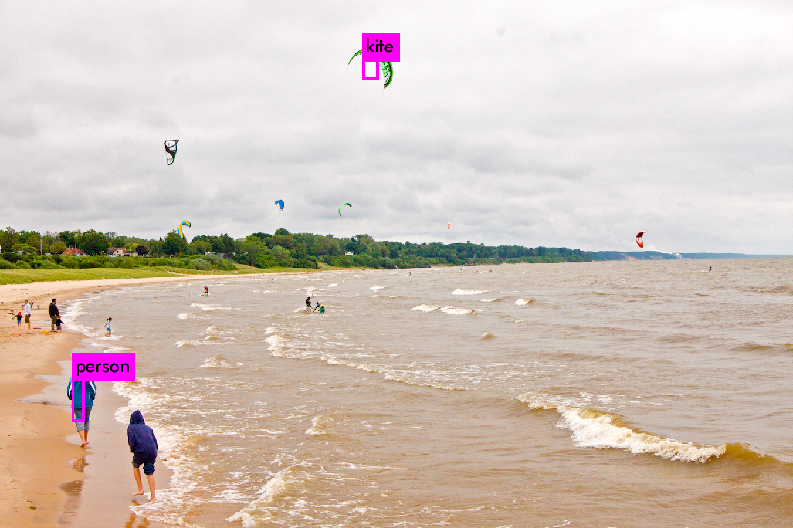
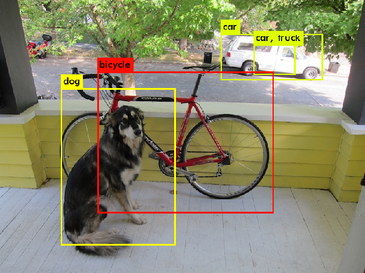

# YOLO and ROS version installation, implementation, application, and comparison
+ Darknet version: [recent github](https://github.com/AlexeyAB/darknet), [homepage](https://pjreddie.com/darknet/), [old github](https://github.com/pjreddie/darknet)
+ OpenCV(DNN) version: [original code gist](https://gist.github.com/YashasSamaga/e2b19a6807a13046e399f4bc3cca3a49)
  + [OpenCV-dnn benchmark and discuss](https://github.com/AlexeyAB/darknet/issues/6245), [OpenCV-dnn benchmark](https://github.com/AlexeyAB/darknet/issues/6067)
+ OpenVINO version - **NOT** OpenVINO built binary, **BUT** OpenVINO enabled OpenCV(DNN) version
+ tensorRT(tkDNN) version - [github](https://github.com/ceccocats/tkDNN)
+ other versions: [other versions links in original github](https://github.com/AlexeyAB/darknet#yolo-v4-in-other-frameworks)

 

| YOLO v3 / v3-tiny v4 / v4-tiny|                        Remark                    |     CPU version | CPU openMP AVX |     GPU support    |
|:-----------------------------------:|:------------------------------------------------:|:---------------:|:--------------------:|:------------------:|
|               Darknet               |                     .c codes                     |        O        |           O          |          O         |
|              OpenCV-dnn             |               OpenCV ver from 4.4.0              |        O        |           -          |          -         |
|      OpenCV-dnn + CUDA/cuDNN     |                 OpenCV ver from 4.4.0            |     utilzed     |           -          |          O         |
|         OpenCV-dnn + OpenVINO    | Intel only,  prebuilt OpenCV from OpenVINO |        O        |           -          | Only for GPU stick |
|           TensorRT(tkDNN)           |                     need GPU                     |     utlized     |           -          |          O         |

 

# Index
## 1. [Results](#1-results-1)

## 2. Prerequisites
#### ● [CUDA / cuDNN](#-cuda--cudnn-1)
#### ● [OpenCV with CUDA / cuDNN](#-opencv-with-cuda--cudnn-1)
#### ● OpenCV with OpenVINO manual build: not recommended, [direct link](https://github.com/opencv/opencv/wiki/Intel's-Deep-Learning-Inference-Engine-backend)
  + OpenVINO's prebuilt binary OpenCV is recommended instead. Refer installation below
#### ● [cv_bridge](#-cv_bridge-opencv---ros-bridge): OpenCV - ROS bridge, should be built when OpenCV is manually built
#### ● [tensorRT](#-tensorrt-1)
#### ● [OpenVINO](#-openvino-1)

## 3. Installation
#### ● [Darknet ver.](#-darknet-ver-2)
#### ● [OpenCV(DNN) ver.](#-opencvdnn-ver-2)
#### ● [OpenVINO ver.](#-openvino-ver-2)
#### ● [tensorRT(tkDNN) ver.](#-tensorrttkdnn-ver-2)

## 4. Installation for ROS version
#### ● [Darknet ver.](#-darknet-ver-3)
#### ● [OpenCV(DNN) ver.](#-opencvdnn-ver-3)
#### ● [OpenVINO ver.](#-openvino-ver-3)
#### ● [tensorRT(tkDNN) ver.](#-tensorrttkdnn-ver-3)

---

    

# 1. Results
#### ● Tested on [2015 MOT dataset](https://motchallenge.net/data/MOT15/)
#### ● on i9-10900k+GTX Titan X(pascal) / i9-10900k+RTX 3080 / Intel NUC10i7FNH (i7-10710U) / Jetson TX2 / Jetson NX
#### ● GPU monitor from Jetsonhacks for *Jetson boards* [here](https://github.com/jetsonhacks/gpuGraphTX)
## ● Youtube videos: <a href="https://www.youtube.com/playlist?list=PLvgPHeVm_WqIUHg7iu0g73-yaS08kv6-5" target="_blank">Playlist of all results</a>
+ text

   

# 2. Prerequisites
### ● CUDA / cuDNN

[CLICK HERE To See]

+ Install **CUDA** and **Graphic Driver**: 
  + for upper than **18.04**,
~~~shell
    $ sudo apt install gcc make
    $ sudo ubuntu-drivers devices
    (not recommended, use CUDA install script below) $ sudo ubuntu-drivers autoinstall
    (not recommended, use CUDA install script below) $ sudo reboot
    
    # get the latest CUDA(with graphic driver) install script at https://developer.nvidia.com/cuda-downloads
    $ sudo sh cuda_<version>_linux.run
        # if want to install only graphic driver, get graphic driver install script at https://www.nvidia.com/Download/index.aspx?lang=en-us
        # sudo ./NVIDIA_<graphic_driver_installer>.run --dkms
        # --dkms option is recommended when you also install NVIDIA driver, to register it along with kernel
        # otherwise, NVIDIA graphic driver will be gone after kernel upgrade via $ sudo apt upgrade
    $ sudo reboot
    
    $ gedit ~/.bashrc
    # type
    export PATH=<CUDA_PATH>/bin:$PATH #ex: /usr/local/cuda-10.1
    export LD_LIBRARY_PATH=<CUDA_PATH>/lib64:$LD_LIBRARY_PATH #ex : /usr/local/cuda-10.1
~~~
  + check CUDA version using **nvcc --version**
~~~shell
# check installed cuda version
$ nvcc --version
# if nvcc --version does not print out CUDA,
$ gedit ~/.profile
# type below and save
export PATH=<CUDA_PATH>/bin:$PATH #ex: /usr/local/cuda-10.1
export LD_LIBRARY_PATH=<CUDA_PATH>/lib64:$LD_LIBRARY_PATH #ex : /usr/local/cuda-10.1
$ source ~/.profile
~~~

 

### ● Trouble shooting for NVIDIA driver or CUDA: please see /var/log/cuda-installer.log or /var/log/nvidia-install.log
+ Installation failed. See log at /var/log/cuda-installer.log for details => mostly because of `X server` is being used.
    + turn off `X server` and install.
~~~shell
# if you are using lightdm
$ sudo service lightdm stop

# or if you are using gdm3
$ sudo service gdm3

# then press Ctrl+Alt+F3 -> login with your ID/password
$ sudo sh cuda_<version>_linux.run
~~~
+ The kernel module failed to load. Secure boot is enabled on this system, so this is likely because it was not signed by a key that is trusted by the kernel.... 
    + turn off `Secure Boot` as below [reference](https://wiki.ubuntu.com/UEFI/SecureBoot/DKMS)
    + If you got this case, you should turn off `Secure Boot` and then turn off `X server` (as above) both.

 

### ● cuDNN: strong library for Neural Network used with CUDA
+ Download [here](https://developer.nvidia.com/cudnn)
+ install as below: [reference in Korean](https://cafepurple.tistory.com/39)
~~~shell
$ sudo tar zxf cudnn.tgz
$ sudo cp extracted_cuda/include/* <CUDA_PATH>/include/   #ex /usr/local/cuda-11.2/include/
$ sudo cp -P extracted_cuda/lib64/* <CUDA_PATH>/lib64/   #ex /usr/local/cuda-11.2/lib64/
$ sudo chmod a+r <CUDA_PATH>/lib64/libcudnn*   #ex /usr/local/cuda-11.2/lib64/libcudnn*
~~~

---

 

### ● OpenCV with CUDA / cuDNN

[CLICK HERE To See]

+ Build OpenCV with CUDA / cuDNN - references: [link 1](https://webnautes.tistory.com/1030), [link 2](https://github.com/jetsonhacks/buildOpenCVXavier/blob/master/buildOpenCV.sh)
~~~shell
$ sudo apt-get purge libopencv* python-opencv
$ sudo apt-get update
$ sudo apt-get install -y build-essential pkg-config
$ sudo apt-get install -y cmake libavcodec-dev libavformat-dev libavutil-dev \
    libglew-dev libgtk2.0-dev libgtk-3-dev libjpeg-dev libpng-dev libpostproc-dev \
    libswscale-dev libtbb-dev libtiff5-dev libv4l-dev libxvidcore-dev \
    libx264-dev qt5-default zlib1g-dev libgl1 libglvnd-dev pkg-config \
    libgstreamer1.0-dev libgstreamer-plugins-base1.0-dev mesa-utils #libeigen3-dev # recommend to build from source : http://eigen.tuxfamily.org/index.php?title=Main_Page
$ sudo apt-get install python2.7-dev python3-dev python-numpy python3-numpy
$ mkdir <opencv_source_directory> && cd <opencv_source_directory>
$ wget -O opencv.zip https://github.com/opencv/opencv/archive/3.4.1.zip # check version
$ unzip opencv.zip
$ cd <opencv_source_directory>/opencv && mkdir build && cd build
# check your BIN version : http://arnon.dk/matching-sm-architectures-arch-and-gencode-for-various-nvidia-cards/
# 8.6 for RTX3080 7.2 for Xavier, 5.2 for GTX TITAN X, 6.1 for GTX TITAN X(pascal)
# -D BUILD_opencv_cudacodec=OFF #for cuda10-opencv3.4
$ cmake -D CMAKE_BUILD_TYPE=RELEASE \
      -D CMAKE_C_COMPILER=gcc-6 \
      -D CMAKE_CXX_COMPILER=g++-6 \
      -D CMAKE_INSTALL_PREFIX=/usr/local \
      -D WITH_CUDA=ON \
      -D OPENCV_DNN_CUDA=ON \
      -D WITH_CUDNN=ON \
      -D CUDA_ARCH_BIN=7.2 \
      -D CUDA_ARCH_PTX="" \
      -D ENABLE_FAST_MATH=ON \
      -D CUDA_FAST_MATH=ON \
      -D WITH_CUBLAS=ON \
      -D WITH_LIBV4L=ON \
      -D WITH_GSTREAMER=ON \
      -D WITH_GSTREAMER_0_10=OFF \
      -D WITH_QT=ON \
      -D WITH_OPENGL=ON \
      -D BUILD_opencv_cudacodec=OFF \
      -D CUDA_NVCC_FLAGS="--expt-relaxed-constexpr" \
      -D WITH_TBB=ON \
      ../
$ time make -j8 # 8 : numbers of core

# when make error, use only one core as
$ time make -j1 # important, use only one core to prevent compile error

$ sudo make install
$ sudo rm -r <opencv_source_directory> #optional
~~~

 

### ● Trouble shooting for OpenCV build error:
+ Please include the appropriate gl headers before including cuda_gl_interop.h => reference [1](https://github.com/jetsonhacks/buildOpenCVXavier/blob/master/buildOpenCV.sh#L101), [2](https://github.com/jetsonhacks/buildOpenCVXavier/blob/master/patches/OpenGLHeader.patch), [3](https://devtalk.nvidia.com/default/topic/1007290/jetson-tx2/building-opencv-with-opengl-support-/post/5141945/#5141945)
+ modules/cudacodec/src/precomp.hpp:60:37: fatal error: dynlink_nvcuvid.h: No such file or directory
compilation terminated. --> **for CUDA version 10**
    + => reference [here](https://devtalk.nvidia.com/default/topic/1044773/cuda-setup-and-installation/error-in-installing-opencv-3-4-0-on-cuda-10/)
    + cmake ... -D BUILD_opencv_cudacodec=OFF ...
+ CUDA_nppicom_LIBRARY not found => reference [here](https://stackoverflow.com/questions/46584000/cmake-error-variables-are-set-to-notfound)
    + $ sudo apt-get install nvidia-cuda-toolkit
    + or Edit *FindCUDA.cmake* and *OpenCVDetectCUDA.cmake*

### ● (Optional) if also **contrib** for OpenCV should be built,
+ add **-D OPENCV_EXTRA_MODULES_PATH** option as below:

~~~shell
$ cd <opencv_source_directory>
$ wget -O opencv_contrib.zip https://github.com/opencv/opencv_contrib/archive/3.4.1.zip #check version
$ unzip opencv_contrib.zip
$ cd <opencv_source_directory>/build
$ cmake -D CMAKE_BUILD_TYPE=RELEASE \
      -D CMAKE_C_COMPILER=gcc-6 \
      -D CMAKE_CXX_COMPILER=g++-6 \
      -D CMAKE_INSTALL_PREFIX=/usr/local \
      -D WITH_CUDA=ON \
      -D OPENCV_DNN_CUDA=ON \
      -D WITH_CUDNN=ON \
      -D CUDA_ARCH_BIN=7.2 \
      -D CUDA_ARCH_PTX="" \
      -D ENABLE_FAST_MATH=ON \
      -D CUDA_FAST_MATH=ON \
      -D WITH_CUBLAS=ON \
      -D WITH_LIBV4L=ON \
      -D WITH_GSTREAMER=ON \
      -D WITH_GSTREAMER_0_10=OFF \
      -D WITH_QT=ON \
      -D WITH_OPENGL=ON \
      -D BUILD_opencv_cudacodec=OFF \
      -D CUDA_NVCC_FLAGS="--expt-relaxed-constexpr" \
      -D WITH_TBB=ON \
      -D OPENCV_EXTRA_MODULES_PATH=../opencv_contrib-3.4.1/modules \
      ../
$ time make -j1 # important, use only one core to prevent compile error
$ sudo make install
~~~

---

 

### ● cv_bridge: OpenCV - ROS bridge

[CLICK HERE To See]

+ If OpenCV was built manually, build cv_bridge manually also
~~~shell
$ cd ~/catkin_ws/src && git clone https://github.com/ros-perception/vision_opencv

# since ROS Noetic is added, we have to checkout to melodic tree
$ cd vision_opencv && git checkout origin/melodic
$ gedit vision_opencv/cv_bridge/CMakeLists.txt
~~~
+ Edit OpenCV PATHS in CMakeLists and include cmake file
~~~txt
#when error, try both lines
find_package(OpenCV 3 REQUIRED PATHS /usr/local/share/OpenCV NO_DEFAULT_PATH
#find_package(OpenCV 3 HINTS /usr/local/share/OpenCV NO_DEFAULT_PATH
  COMPONENTS
    opencv_core
    opencv_imgproc
    opencv_imgcodecs
  CONFIG
)
include(/usr/local/share/OpenCV/OpenCVConfig.cmake) #under catkin_python_setup()
~~~

~~~shell
$ cd .. && catkin build cv_bridge
~~~

---

 

### ● tensorRT

[CLICK HERE To See]

---

 

### ● OpenVINO

[CLICK HERE To See]

---

   

# 3. Installation
### ● Darknet ver.

[CLICK HERE To See]

  
+ Clone and make
~~~shell
  $ cd 
  $ git clone https://github.com/pjreddie/darknet
  $ gedit Makefile # => Edit first 3 lines if you want to use them (OPENCV=1 is needed to watch GUI result)
  $ make
~~~
+ Download weights from homepage
~~~shell
  $ cd ~/darknet
  $ wget https://pjreddie.com/media/files/yolov3.weights
  $ wget https://pjreddie.com/media/files/yolov3-tiny.weights #for tiny (much faster, less accurate)
~~~

  

### ● Execution

+ Using on Test data (Image)
~~~shell
  $ ./darknet detect cfg/yolov3.cfg yolov3.weights data/dog.jpg #or any other image files
   # -> yolov3 will assume memory a lot.
  $ ./darknet detect cfg/yolov3-tiny.cfg yolov3-tiny.weights data/dog.jpg  #V3 tiny
~~~
+ Using on Test data (Video, Live)
~~~shell
  $ ./darknet detector demo cfg/coco.data cfg/yolov3.cfg yolov3.weights data/dog.jpg #or any other image files
   # -> yolov3 will assume memory a lot.
  $ ./darknet detector demo cfg/coco.data cfg/yolov3-tiny.cfg yolov3-tiny.weights data/dog.jpg  #V3 tiny
~~~
+ Using onboard camera of TX2 development kit (Live), *tiny*
~~~shell
  $ ./darknet detector demo cfg/coco.data cfg/yolov3-tiny.cfg yolov3-tiny.weights "nvcamerasrc ! video/x-raw(memory:NVMM), width=(int)1280, height=(int)720,format=(string)I420, framerate=(fraction)30/1 ! nvvidconv flip-method=0 ! video/x-raw, format=(string)BGRx ! videoconvert ! video/x-raw, format=(string)BGR ! appsink"
~~~
+ Using USB camera on TX2 (Live), *tiny*
~~~shell
  $ ./darknet detector demo cfg/coco.data cfg/yolov3-tiny.cfg yolov3-tiny.weights -c 1 # 1 is camera number, as onboard camera is 0, usb camera is 1
  $ ./darknet detector demo cfg/coco.data cfg/yolov3-tiny.cfg yolov3-tiny.weights /dev/video1 #same here
  # if not using development kit, instead carrier board, usb camera will be camera0
~~~

  

### ● Trouble shooting
+ *not such file of directory tegra/libGL.so* when building **OpenCV**
  + Change the script file before run it, [here](https://github.com/jetsonhacks/buildOpenCVTX2/pull/34/files)
+ *make[2]: *** No rule to make target '/usr/lib/aarch64-linux-gnu/libGL.so', needed by 'lib/libopencv_cudev.so.3.4.1'. Stop.*
  + **OpenCV** was not built well.
  + or for TX2, did not build **OpenCV** manually yet -> If you want to use pre-installed OpenCV from Jetpack, 
+ *nvcc not found* -> After OpenCV, when building **YOLOv3**
  ~~~shell
    $ echo "export PATH=/usr/local/cuda-8.0/bin${PATH:+:${PATH}}" >> ~/.bashrc
    $ echo "export LD_LIBRARY_PATH=/usr/local/cuda-8.0/lib64${LD_LIBRARY_PATH:+:${LD_LIBRARY_PATH}}" >> ~/.bashrc
    # or type those exports into ~/.bashrc manually
    $ source ~/.bashrc
  ~~~
+ *No such file lib....* when **execute**
~~~shell
  $ sudo ldconfig
~~~
  
  

### ● Result

 

+ **Result [Video on Xavier NX](https://youtu.be/Rqkp7XEiQqU)
+ **Result [video on TX2 using USB cam](https://youtu.be/w3Em89Z58og)** with ***default cfg, default weights, default trained model***
  + on the monitor playing youtube [video for detection](https://www.youtube.com/watch?v=wqctLW0Hb_0&feature=youtu.be)
  

  
  

 

+ on Test image with ***default cfg, default weights, default trained model***
  

  
  

  

  
  

---

 

### ● OpenCV(DNN) ver.

[CLICK HERE To See]

---

 

### ● OpenVINO ver.

[CLICK HERE To See]

---

 

### ● tensorRT(tkDNN) ver.

[CLICK HERE To See]

---

   

# 4. Installation for ROS version
### ● Darknet ver.

[CLICK HERE To See]

  
#### original repo - upto [v4 : here](https://github.com/tom13133/darknet_ros), upto [v3 : here](https://github.com/leggedrobotics/darknet_ros)
+ Get and build Darknet_ROS version from upto [v4 : here](https://github.com/tom13133/darknet_ros) upto v3 [here](https://github.com/leggedrobotics/darknet_ros)
~~~shell
$ cd catkin_workspace/src
$ git clone https://github.com/leggedrobotics/darknet_ros # up to v3
$ git clone https://github.com/tom13133/darknet_ros # up to v4
$ cd darknet_ros/ && git submodule update --init --recursive
$ cd ~/catkin_workspace
# before build, check (-O3 -gencode arch=compute_<version>,code=sm_<version>) part in darknet_ros/darknet_ros/CMakeLists.txt if you use CUDA
# ex) 75 for GTX1650
$ catkin build darknet_ros -DCMAKE_BUILD_TYPE=Release
~~~

### Running
+ To run, need cfg files from [darknet homepage](https://github.com/AlexeyAB/darknet/tree/master/cfg)
+ need weights file
~~~shell
$ wget https://pjreddie.com/media/files/yolov3-tiny.weights
# or download at the site : https://github.com/AlexeyAB/darknet/releases
~~~
+ and use the proper .yaml file and .launch files as attached in this repo

~~~shell
$ roslaunch darknet_ros yolov3tiny.launch
$ roslaunch darknet_ros yolov4tiny.launch
~~~

 

### Results
+ with Logitech c930e Video clip [here](https://youtu.be/nfPVkNXSs-A)

---

 

### ● OpenCV(DNN) ver.

[CLICK HERE To See]

---

 

### ● OpenVINO ver.

[CLICK HERE To See]

---

 

### ● tensorRT(tkDNN) ver.

[CLICK HERE To See]

---

 

